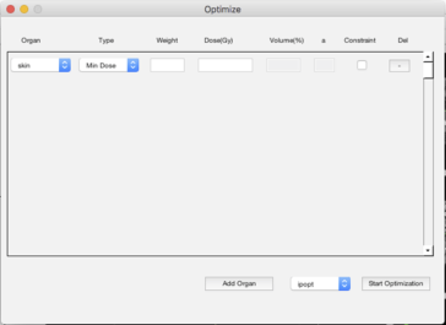
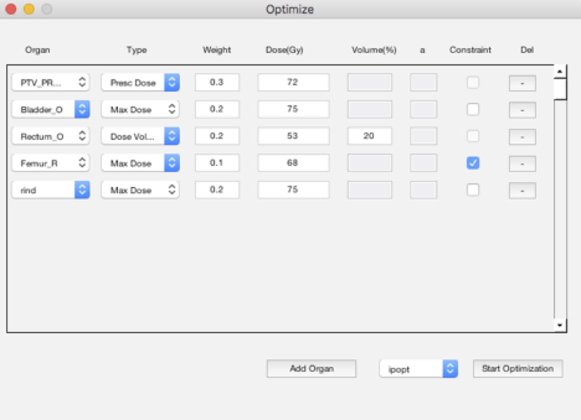
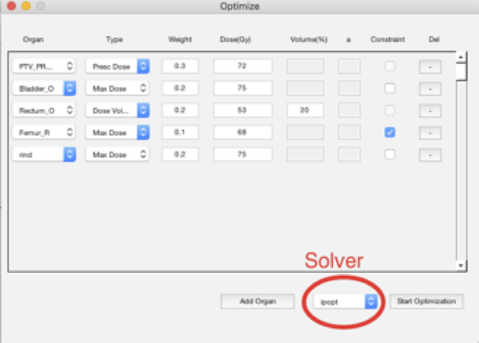

Contact tiwari.paras@gmail.com for any questions. 
**Installing IMRTOptimization**

System Requirement: Matlab 2015 or later
Operating System: Windows 64 bit, Linux 64 bit, Mac OSX
1.	Perform git clone https://github.com/ptiwari/IMRTOptimization.git
2.	Open Matlab and add IMRTOptimization folder in the Matlab Path. The IMRTOptimization module is tested in Matlab 2015 and later release. 

**Quick Start**
1.	Create a CERR plan
a.	Refer http://cerr.info/wiki/index.php/Install_instructions?w=CERRWiKi to download and install CERR
b.	Download sample data from 
i.	H&N: http://cerr.info/files/head_neck_ex1_20may03.mat.bz2
ii.	Prostate: http://cerr.info/files/prostex_9may03.mat.bz2
iii.	Lung: http://cerr.info/files/lung_ex1_20may03.mat.bz2
c.	Create CERR plan. Refer http://cerr.info/wiki/index.php/CERR?w=CERRWiKi#DICOM_Import.2C_which_is_DICOMJ for creating CERR plan from DICOM file.
d.	Compute the Dose using CERR. Refer http://cerr.info/wiki/index.php/CERR?w=CERRWiKi#IMRTP for CERR IMRTP GUI.
2.	After Calculating Dose in CERR, click on IMRT>>Optimize to open Optimization GUI.

Figure 1: Optimization GUI displayed from IMRT>>Optimize
 
3.	Select organ and objective for the organ. 
Figure 2: Selecting organs and objectives. The user need to provide the weight of each objective. The sum of all weights must be equal to one. The system supports Minimum Dose, Maximum Dose, Prescription Dose, Dose Volume, and gEUD as objectives or constraints. The goal can be turned into constraints by selecting constraint checkbox. If an objective can’t be used as a constraint, the constraint checkbox is disabled for the objective. 

Figure 2: Selecting organs and objectives. The user need to provide the weight of each objective. The sum of all weights must be equal to one. The system supports Minimum Dose, Maximum Dose, Prescription Dose, Dose Volume, and gEUD as objectives or constraints. The goal can be turned into constraints by selecting constraint checkbox. If an objective can’t be used as a constraint, the constraint checkbox is disabled for the objective. 

4.	Select a Solver. The system provides IPOPT and Knitro. IPOPT uses the interior point method to solve the optimization problem. Knitro provides four different algorithms to solve the problem. Refer https://www.artelys.com/tools/knitro_doc/2_userGuide/algorithms.html to understand more about the algorithm. Below is the brief description about each algorithm

a.	Knitro_Direct (Interior/Direct algorithm): computes new iterates by solving the primal-dual KKT matrix using direct linear algebra.
b.	Knitro_CG(Interior/CG algorithm): Primal-dual KKT system is solved using a projected conjugate gradient iteration.
c.	Knitro_Active(Active Set algorithm): Solve a sequence of subproblems based on a quadratic model of the original problem.
d.	Knitro_SQP(Sequential Quadratic Programming (SQP) algorithm)

5.	Click on Start Optimization. The button is disabled while optimization is being performed and enabled after optimization is completed. The output of the solver can be seen in the Matlab console. 
6.	The optimization saves dose as OptimizedDose and the dose can be viewed from CERR Dose menu.
